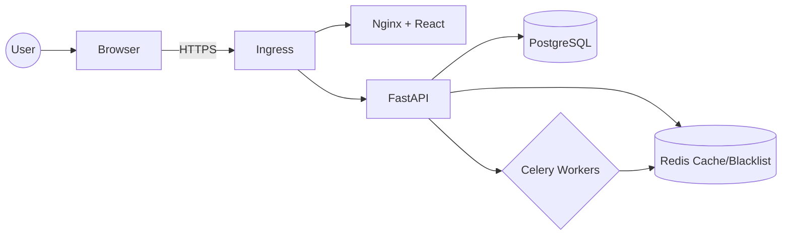
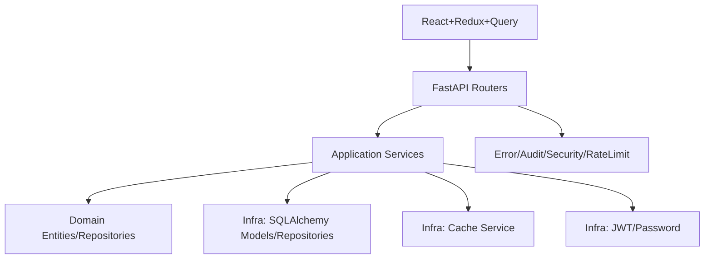
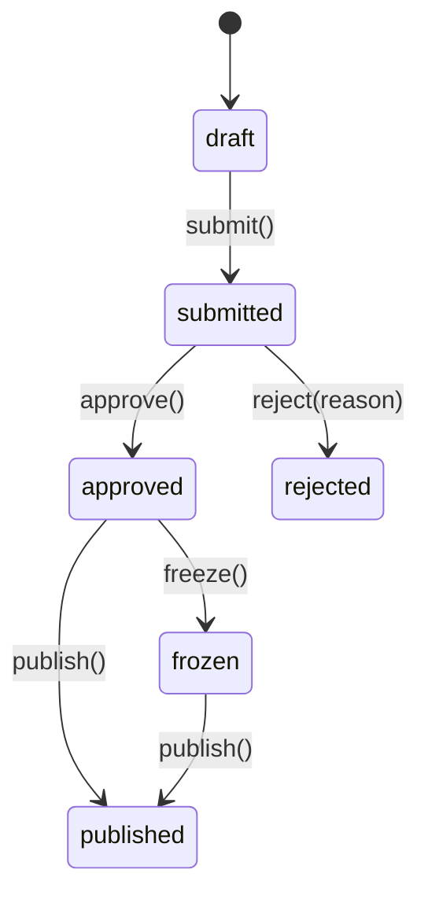
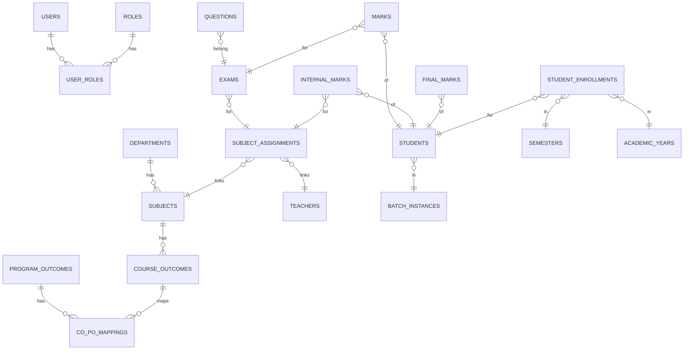

# DSABA LMS – Comprehensive Technical Documentation

## Executive Summary
- DSABA LMS is a clean-architecture LMS built on FastAPI (backend) and React+TypeScript (frontend), designed for internal exam management, CO-PO attainment analytics, student enrollments, and academic workflows.
- Backend stack: PostgreSQL, SQLAlchemy, Redis caching and JWT blacklist, Celery background jobs, Alembic migrations. Frontend stack: Vite, TailwindCSS, Redux Toolkit, TanStack Query, Vitest, Playwright.
- Core workflows: authentication, marks entry/approval/publishing, analytics dashboards, CO/PO attainment, reports/PDF generation, bulk uploads, student enrollments and promotions, audit logging, rate limiting.

## 1. Application Overview & Purpose
- Purpose: Manage academic assessments and outcomes across departments and semesters; enable evidence-backed CO/PO attainment and institutional analytics.
- Core features: Authentication, department/subject management, exams/questions/marks, internal marks workflow, final marks publishing, analytics (basic + enhanced), CO/PO framework, academic structure (batches/semesters/enrollments), reports/PDF, bulk uploads, audit, backup, monitoring.
- Target users & roles: Admin, Principal, HOD, Teacher, Student with role-based permissions.
- Business problems solved: Streamlined end-to-end assessment lifecycle, outcome attainment visibility, department-level analytics, reduced manual effort.
- KPIs: pass rates; SGPA/CGPA; CO/PO attainment threshold compliance; 95p response time < 1s; error rate < 5%; publishing SLAs.

## 2. Architecture & Design Patterns
- Clean Architecture + DDD layered structure:
  - Domain: entities, value objects, repositories, exceptions (`backend/src/domain/*`).
  - Application: services and DTOs (`backend/src/application/*`).
  - Infrastructure: database models & repositories, cache, security, queue (`backend/src/infrastructure/*`).
  - API: FastAPI routers, middleware, dependencies (`backend/src/api/*`); app wiring at `backend/src/main.py:78–86,160–272`.
- Patterns:
  - Repository pattern (interfaces vs SQLAlchemy impls).
  - DTOs for stable API contracts.
  - Middleware for cross-cutting concerns (error handling, audit, headers, rate limiting).
  - Dependency injection via FastAPI `Depends`.
- Trade-offs: Denormalized/legacy fields retained for performance/backward compatibility; layered cache (memory+Redis) for resilience.

## 3. Database Schema & Relationships
- Database: PostgreSQL (production), SQLite (dev).
- Key schemas (tables, constraints, indexes) defined in `backend/src/infrastructure/database/models.py`:
  - IAM: `users`, `password_reset_tokens`, `roles`, `user_roles`, `permissions`, `role_permissions`.
  - Academic: `departments`, `batches`, `batch_instances`, `sections`, `semesters`, `academic_years`.
  - Profiles: `students`, `teachers`, `student_enrollments`, `promotion_history`.
  - Curriculum & Assessment: `subjects`, `subject_assignments`, `program_outcomes`, `course_outcomes`, `co_po_mappings`, `exams`, `questions`, `sub_questions`, `marks`, `final_marks`, `internal_marks`.
  - Audit & Indirect attainment: `audit_logs`, `mark_audit_logs`, `marks_workflow_audit`, `surveys`, `survey_questions`, `survey_responses`, `exit_exams`, `exit_exam_results`.
- Relationships examples:
  - User ↔ Role (many-to-many via `user_roles`)
  - SubjectAssignment ties subject+teacher+semester+academic_year (`SubjectAssignmentModel:541–557`).
  - Enrollment unique on student+semester+academic_year (`StudentEnrollmentModel:363–373`).
  - Internal marks workflow with audit (`InternalMarkModel:835–875`; `MarksWorkflowAuditModel:915–927`).

## 4. Data Models & Entities
- Domain entities mirror database models but encapsulate business rules; value objects such as `Email` and `Password` enforce validation.
- Internal marks lifecycle and validations in services (`backend/src/application/services/internal_marks_service.py:30–74`).
- Exceptions hierarchy: `backend/src/domain/exceptions/base.py`, `auth_exceptions.py`.

## 5. API Endpoints & Data Flow
- Prefix `/api/v1` (`backend/src/config.py:249–256`).
- Routers included in `backend/src/main.py:160–272` cover auth, users, departments, exams, questions, marks, internal/final marks, analytics/enhanced analytics, CO/PO mappings, reports/PDF, academic years/semesters/batches, student enrollments, audit, backup, monitoring.
- Authentication: JWT bearer; dependency validates token and user status (`backend/src/api/dependencies.py:77–150`).
- Error handling: domain exceptions → HTTP responses (`backend/src/api/middleware/error_handler.py:25–213`).
- Pagination/filtering: standard `skip`, `limit` and filter params across list endpoints.

## 6. Frontend Components & UI
- Technology: React+TS, Vite, Tailwind.
- Pages by role in `frontend/src/pages/*`, shared components in `frontend/src/components/shared/*`, routing in `frontend/src/modules/*/routes.tsx`, role guard in `frontend/src/core/guards/RoleGuard.tsx`.
- State: Redux Toolkit slices (`frontend/src/store/slices/*`) and TanStack Query for server state (`frontend/src/core/hooks/*`).

## 7. Business Logic & Workflows
- Internal marks workflow: draft → submitted → approved → frozen → published; transitions enforced with audit logging (`internal_marks_service.py:200–273,428–449`).
- Final marks aggregate and publishing; SGPA/CGPA calculations.
- CO/PO attainment: CO thresholds L1/L2/L3; PO weighted by mapping strength.
- Batch promotions and student enrollments.

## 8. Authentication & Security
- JWT with 30-minute access token and 7-day refresh, Redis blacklist (`backend/src/infrastructure/security/jwt_handler.py:27–35,138–171`).
- Password hashing via bcrypt (`backend/src/infrastructure/security/password_hasher.py:17–24,31–35`).
- Security headers and CORS (`backend/src/api/middleware/security_headers.py:22–42`; `backend/src/main.py:91–99`).
- Rate limiting & basic DDoS (`backend/src/api/middleware/rate_limiting.py:118–151,154–203,206–290`).
- Audit middleware logging request/response (`backend/src/api/middleware/audit_middleware.py:21–31,111–152,156–211`).

## 9. Performance & Scalability
- Caching: memory+Redis, TTLs and tags (`backend/src/infrastructure/cache/redis_client.py`).
- DB pooling and monitoring (`backend/src/infrastructure/database/session.py:50–83`; `backend/src/infrastructure/database/monitoring.py`).
- Celery tasks for analytics/report cleanup/cache warming (`backend/src/infrastructure/queue/celery_app.py`, `queue/tasks/*`).
- Kubernetes deployments, HPA, ingress (`k8s/*`).
- Performance tests: Locust (`backend/tests/performance/locustfile.py:242–250`).

## 10. Testing & Quality Assurance
- Backend tests: `backend/tests/api/*`, `application/*`, `domain/*`, `infrastructure/*`.
- Frontend: Vitest unit tests; Playwright e2e.
- CI/CD pipeline executes linting, tests, docker builds, compose integration test, security scan, performance test, e2e (`.github/workflows/ci-cd.yml`).

## 11. Deployment & Infrastructure
- Dockerfiles and Compose for dev/prod.
- Kubernetes manifests for backend/frontend, Postgres/Redis, PVC, HPA and ingress.
- Backup & disaster recovery via backup service (`backend/src/infrastructure/backup/backup_service.py`).

## 12. User Roles & Permissions
- Roles, hierarchy, display names and permissions (`backend/src/domain/enums/user_role.py:20–37,71–113,117–212`).
- Role-based UI routing and guards; department scoping and resource ownership enforced by services.

## 13. Integration Points
- Optional S3/SMTP; file uploads for bulk imports; planned webhooks.

## 14. Monitoring & Logging
- Structured logging; Sentry optional; DB performance monitoring; health endpoints.

## 15. Configuration & Environment
- Environment-based settings via `pydantic_settings`; feature flags; validated types (`backend/src/config.py`).

## 16. Error Handling & Exceptions
- Centralized error handlers, user-friendly JSON responses, graceful rollback and audit.

## 17. Data Migration & Seeding
- Alembic migrations; dev table bootstrap; seeding scripts (`backend/scripts/init_db.py` – legacy, prefer `role_initializer`).

## 18. Code Quality & Standards
- Python: Black, flake8, mypy; TypeScript: ESLint, type-check; CI gates.

## 19. Future Enhancements & Roadmap
- Webhooks; Prometheus metrics; stronger DDoS/WAF; indirect attainment expansion; legacy removal; test coverage to 80%.

## 20. Troubleshooting & Support
- Common issues: 401/403 auth, 429 rate limit, DB/migrations, cache anomalies.
- Debug: logs, DB monitor, `/health`, `/cache/clear`.
- Rollback and backups; Slack notifications configured in CI deploy.

---

## Architecture Diagrams (Mermaid)

### System Diagram

### Component Diagram

### Internal Marks Workflow

### Database ERD (High-Level)

---

## API Reference Notes
- Base URL: `/api/v1` in development; production via ingress host.
- Auth headers: `Authorization: Bearer <access_token>`.
- Access token expiry: 30 minutes; refresh token: 7 days (`backend/src/config.py:35–39`).
- Common errors follow standardized JSON via middleware.

## Recommendations
- Align any external docs with settings and code; prefer `docs/DSABA_LMS_TECHNICAL_DOCUMENTATION.md` as source of truth.