# **COLLEGE OUTCOME-BASED LMS – SMART MARKS & CO-PO ANALYSIS SYSTEM**  
### **Version 5.0 – Comprehensive Developer-Ready Documentation**  
**Full Expansion | Detailed Flows | NBA/NAAC Compliance | CO-PO Focused | Bulk Uploads | Offline Exam Digitization**  

**Document Purpose**: This is the **master blueprint** for the development team. Every section is expanded with:  
- **Detailed Explanations**: What, Why, How.  
- **Developer Notes**: Implementation tips, edge cases, best practices.  
- **UI/UX Guidance**: Wireframe-like descriptions.  
- **Data Flows**: Mermaid diagrams for every major process.  
- **Validation & Error Handling**: Built-in rules.  

**Assumptions**:  
- Backend: FastAPI (Python) with SQLAlchemy ORM.  
- Frontend: React.js with TailwindCSS, AG-Grid for tables, Recharts for analytics.  
- Database: PostgreSQL for relational integrity.  
- All dates in UTC; use `timezone-aware` timestamps.  

**Version History**:  
- v4.0: Added bulk uploads + exam-centric.  
- v5.0: **Full expansion** with flows for ALL requirements.  

---

## **1. PROJECT TITLE & VISION**  
**SmartLMS: Outcome-Based Education (OBE) Marks & Attainment Analysis Portal**  

### **Expanded Vision**  
This system is a **comprehensive digital backbone** for college academic evaluation, transforming **offline exams into traceable, analyzable data assets**. It digitizes the entire lifecycle: from **exam creation** (with question banking) to **marks entry** (manual/bulk), **smart calculation** (handling optionals/sub-questions), **CO-PO attainment tracking**, and **multi-dimensional reporting**.  

**Why Build This?**  
- **Manual Pain Points Solved**: No more scribbled answer sheets or Excel hacks—**auto-capped marks**, **audit-proof changes**, **one-click NBA reports**.  
- **OBE Compliance**: Every question maps to **CO (Course Outcome)** and **PO (Program Outcome)**, enabling **precise attainment %** (e.g., "CO1 achieved 72% in CSE Sem-3").  
- **Scalability**: Handles 10,000+ students, 500+ concurrent users.  
- **Offline-First**: Exams are printed/conducted offline; system only manages **digital records** for evaluation.  

**Key Differentiators**:  
- **Smart Automation**: Caps optional answers (e.g., "Answer any 4/6 → take best 4").  
- **Bulk Efficiency**: Upload 200-student marks in 5 minutes.  
- **Analytics Depth**: Drill-down from "Batch 2023 Pass %" to "Question Q1 CO1 weakness".  

**Target Users**: Principals (oversight), HODs (dept control), Teachers (daily ops), Students (self-view).  

---

## **2. SYSTEM OBJECTIVES – EXPANDED**  

| # | Objective | Detailed Explanation | Success Metric | Dev Impact |
|----|-----------|----------------------|---------------|------------|
| **1** | Automate 2 Internals + 1 External per subject with smart capping. | Handle offline exams: I1/I2 (formative, 40% weight), External (summative, 60%). Auto-apply rules like "best of optionals" to prevent over-marking. | 100% error-free totals; <1% manual overrides. | Core engine in backend; unit tests for capping logic. |
| **2** | Enable question-level CO-PO mapping for accurate attainment. | Each question tags to CO/PO/Bloom’s; aggregate to student/subject/dept levels. | CO attainment reports match NBA format. | Junction tables; JSONB for flexible mapping. |
| **3** | Implement smart optional/sub-question handling. | Detect min required answers per section; split marks hierarchically (Q1: 10 → 1a:4, 1b:6). | No extra marks awarded; audit shows capping. | Python function triggered on save. |
| **4** | Enforce 4-tier hierarchical roles with multi-role support. | Principal > HOD > Teacher > Student; e.g., HOD can act as Teacher. | Zero unauthorized access; RBAC middleware. | Enum roles + junction table. |
| **5** | Provide 7-day teacher edit window + HOD/Principal override. | Time-bound locks prevent tampering; overrides require reason. | <5% overrides per semester. | Timestamp checks in API guards. |
| **6** | Deliver real-time analytics dashboards. | CO-PO heatmaps, Bloom’s distribution, year-over-year trends. | Load <2s; exportable to PDF/Excel. | Celery for nightly pre-compute; Recharts. |
| **7** | Support easy question paper generation + bulk uploads. | Auto-assemble from bank; parse uploaded papers. | 90% parse accuracy. | PDF lib + regex parsing. |

---

## **3. USER ROLES & HIERARCHY – EXPANDED**  

### **Role Definitions**  
Each role has **granular permissions** enforced via **JWT claims** (e.g., `{ "role": "teacher", "dept_id": 1, "subjects": [123] }`).  

| Role | Full Name | Scope Details | Permissions Breakdown | Dashboard Highlights |
|------|-----------|---------------|-----------------------|----------------------|
| **P** | **Principal** | **Global**: All depts, batches, years; no restrictions. | - Create/edit all structures (batches, depts).<br>- Define global PO/CO.<br>- Override any marks.<br>- View/export all analytics.<br>- Manage all users. | - Overview cards: Total students, avg SGPA, CO gaps.<br>- Dept-wise heatmap. |
| **H** | **Head of Department** | **Department-Level**: Own dept only (e.g., CSE HOD sees only CSE data). Can act as Teacher for own subjects. | - Manage dept users/students.<br>- Assign CO to subjects.<br>- Create exams/questions for dept.<br>- Override teacher marks (with reason).<br>- Dept-specific analytics. | - Dept performance trends.<br>- Teacher-wise CO attainment. |
| **T** | **Teacher** | **Subject-Level**: Only assigned subjects in specific batch-year-semester. | - Create exams/questions for assigned subjects.<br>- Enter/edit marks (7-day window).<br>- Bulk uploads.<br>- View class analytics (own subjects). | - Assigned exams list.<br>- Student grid preview. |
| **S** | **Student** | **Personal**: Own enrolled data only (read-only). | - View marks/grades/CO-PO reports.<br>- Download PDF report card.<br>- See notifications. | - Personal timeline: Sem-wise SGPA.<br>- Weak CO recommendations. |

### **Multi-Role Handling**  
- A user (e.g., HOD) can have `roles: ['hod', 'teacher']`.  
- **Dev Note**: Query `user_roles` junction; highest privilege wins (Principal > HOD > etc.).  
- **Edge Case**: Role conflict—e.g., HOD editing another dept's marks → 403 Forbidden.  

### **User Onboarding Flow** (Mermaid)  
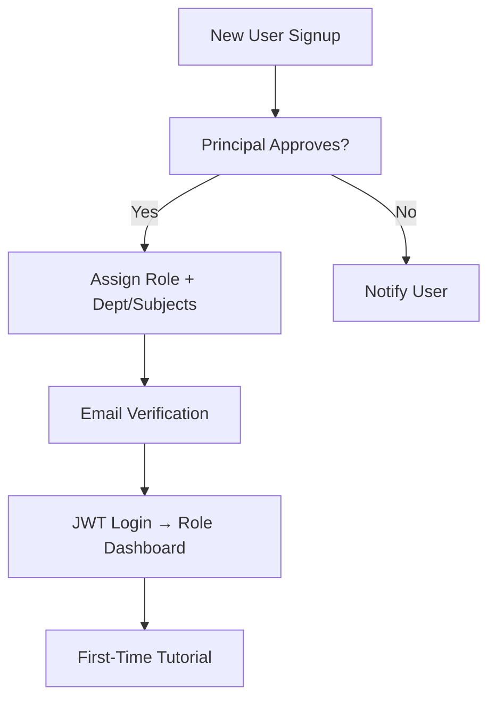

---

## **4. EXPANDED FUNCTIONAL REQUIREMENTS (FRs)**  
Each FR includes: **Inputs/Outputs**, **Flow Diagram**, **Validation**, **Dev Notes**.  

### **FR-01: Secure Login with Role-Based Dashboard**  
**Purpose**: Authenticate users and route to personalized views.  

**Inputs**: `{ email, password, remember_me? }`  
**Outputs**: `{ jwt_token, refresh_token, user: { id, role, dept_id } }` → Redirect to `/dashboard/{role}`.  

**Validation**:  
- Email format, password >8 chars.  
- Failed attempts → CAPTCHA after 3.  

**Flow Diagram** (Mermaid):  
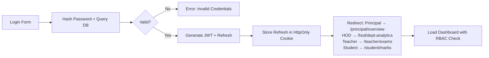

**Dev Notes**:  
- Use **bcrypt** for hash; **PyJWT** for tokens (exp: 1hr, refresh: 24hr).  
- Middleware: `@app.middleware("http")` checks `role` claim.  
- Edge: Session hijack → invalidate all tokens via blacklist (Redis).  
- UI: Dark mode toggle; loading spinner on submit.  

### **FR-02: Manage Batches (e.g., B.Tech, MBA)**  
**Purpose**: Define core programs; basis for all structures. **P only**.  

**Inputs**: `{ name, duration_years (e.g., 4), is_active }`  
**Outputs**: Updated batch list table.  

**Validation**: Unique name; duration 2–5 years.  

**Flow Diagram**:  
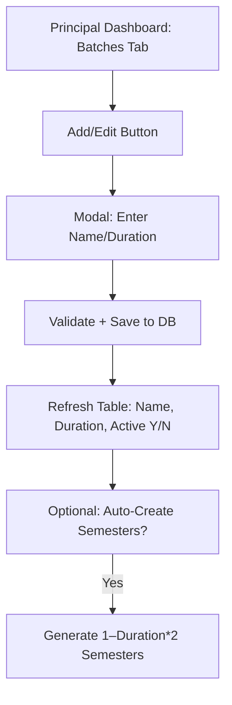

**Dev Notes**:  
- Table: AG-Grid with search/sort/export.  
- Auto-generate: On save, insert into `semesters` if flagged.  
- Edge: Deactivate batch → cascade to inactive years.  

### **FR-03: Manage Batch Years (e.g., 2023–27)**  
**Purpose**: Track admissions yearly; enables parallel batches. **P only**.  

**Inputs**: `{ batch_id, start_year, end_year, is_current }`  
**Outputs**: Year cards with student count preview.  

**Validation**: End > start; no overlap with existing.  

**Flow Diagram**:  
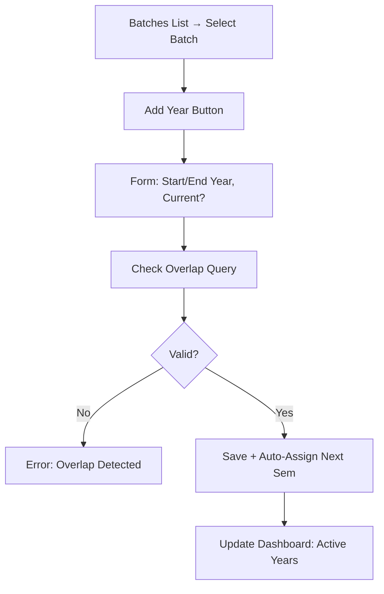

**Dev Notes**:  
- Query: `SELECT * FROM batch_years WHERE batch_id = ? AND (start_year BETWEEN ? AND ?)` for overlap.  
- UI: Calendar picker for years.  
- Edge: Promote "current" → set prev to false.  

### **FR-04: Manage Semesters per Batch-Year**  
**Purpose**: Segment academic progress; link to subjects/marks. **P only**.  

**Inputs**: `{ batch_year_id, semester_no (1–8), is_current, start_date, end_date }`  
**Outputs**: Timeline view of semesters.  

**Validation**: No duplicates; dates sequential.  

**Flow Diagram**:  
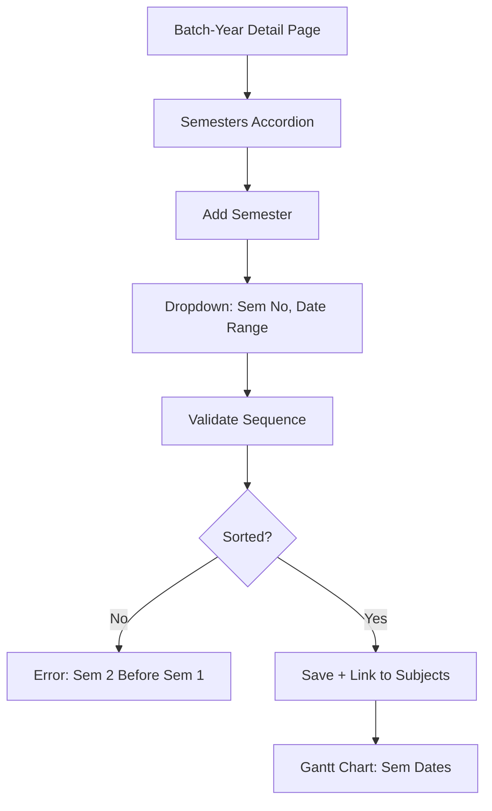

**Dev Notes**:  
- Use `semester_no` as unique per year.  
- UI: Gantt with Recharts for date overlaps.  
- Edge: Extend dates → notify HODs.  

### **FR-05: Create Departments & Assign HOD**  
**Purpose**: Organize faculty/students; scope for analytics. **P only**.  

**Inputs**: `{ name, code (e.g., CSE), hod_id (from teachers) }`  
**Outputs**: Dept list with HOD name, student count.  

**Validation**: HOD must be teacher; unique code.  

**Flow Diagram**:  
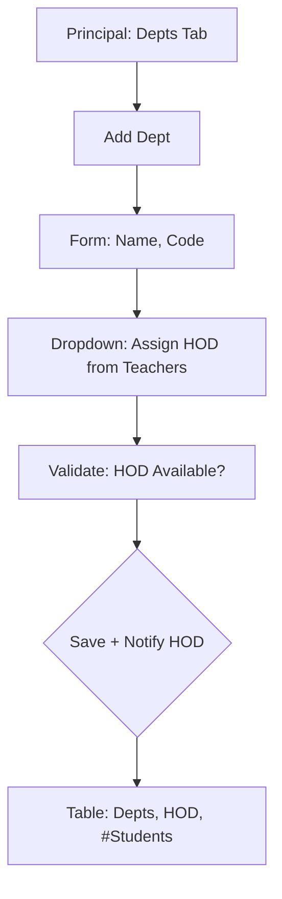

**Dev Notes**:  
- FK: `hod_id → users.id` where role='teacher'.  
- Trigger: On assign, email "Welcome HOD".  
- Edge: Reassign HOD → log change.  

### **FR-06: Define PO & CO per Department**  
**Purpose**: Foundation for OBE; map outcomes to questions/marks. **P & H** (H: own dept).  

**Inputs**:  
- PO: `{ dept_id, code (PO1), description, target_attainment (e.g., 70%) }`  
- CO: `{ subject_id, code (CO1), description }`  

**Outputs**: Hierarchical tree: Dept → PO → Subjects → CO.  

**Validation**: Codes unique per level; description >50 chars.  

**Flow Diagram**:  
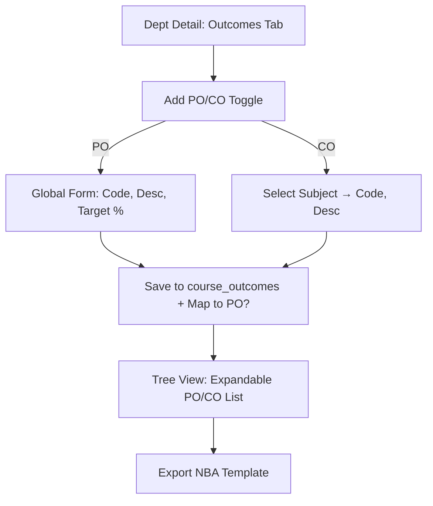

**Dev Notes**:  
- JSONB for `po_mapping` in CO table (array of PO codes).  
- UI: Nested accordion; drag to map CO→PO.  
- Edge: Update target % → recalculate attainment cache.  

### **FR-07: Create Exam (Offline) – Core Workflow**  
**Purpose**: Structure every assessment; link questions/marks. **P, H, T** (scoped).  

**Inputs**: `{ subject_assignment_id, exam_type (I1/I2/External), name, date, total_marks, duration, instructions }`  

**Outputs**: Exam card in dashboard with status badge.  

**Validation**: One exam per type per subject-sem; date future.  

**Flow Diagram** (Expanded from v4):  
```mermaid
graph TD
    A[Teacher/HOD Dashboard: Subjects → Select Subject] --> B[Create Exam Button]
    B --> C[Form: Type (I1/I2/Ext), Name, Date, Total Marks, Duration, Instructions]
    C --> D[Validate: Duplicate Type?]
    D --> E{OK?}
    E -->|No| F[Error: I1 Already Exists]
    E -->|Yes| G[Save Draft Exam to DB]
    G --> H{Add Questions?}
    H -->|Later| I[Exam Status: Draft]
    H -->|Now| J[Redirect to FR-08/09]
    J --> K[Questions Added → Generate Paper (FR-10)]
    K --> L[Print/Conduct Offline]
    L --> M[Back to System → Enter Marks (FR-11/12)]
    M --> N[Marks Complete → Smart Calc (FR-13)]
    N --> O[7-Day Edit (FR-14) → Lock]
    O --> P[Publish (FR-16) → Analytics Update]
```

**Dev Notes**:  
- Enum status: 'draft' → 'questions_added' → 'marks_entry' → 'locked' → 'published'.  
- UI: Stepper wizard (1. Details → 2. Questions → 3. Marks).  
- Edge: Cancel mid-flow → rollback transaction.  

### **FR-08: Manual Question Entry (Per Exam)**  
**Purpose**: Build question bank incrementally. **T, H, P**.  

**Inputs**: Per question: `{ text, section (A/B/C), required_count, optional_count, marks_per_qn, bloom_level (L1–L6), co_mapped[], po_mapped[], sub_questions[] }`  

**Outputs**: Questions list in exam detail; reorderable.  

**Validation**: Total marks = sum sections; CO from subject’s list.  

**Flow Diagram**:  
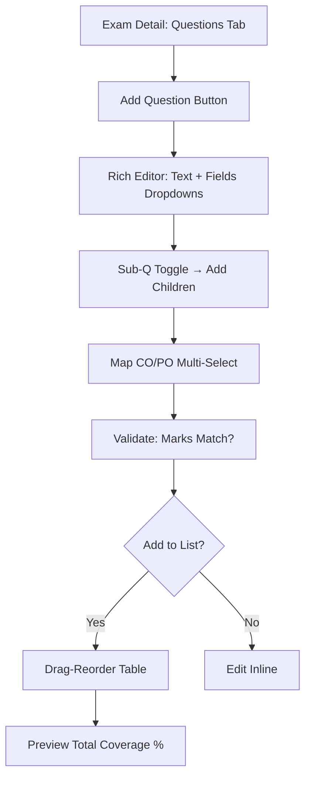

**Dev Notes**:  
- Rich editor: Quill.js.  
- Junction inserts for maps.  
- Edge: Delete question → confirm if marks entered.  

### **FR-09: Bulk Question Upload (Word/Excel/CSV)**  
**Purpose**: Fast import from legacy papers. **T, H, P**.  

**Inputs**: File upload + format selector.  

**Outputs**: Preview table → confirm → parsed questions.  

**Validation**: Parse errors highlighted; min 80% success.  

**Flow Diagram**:  
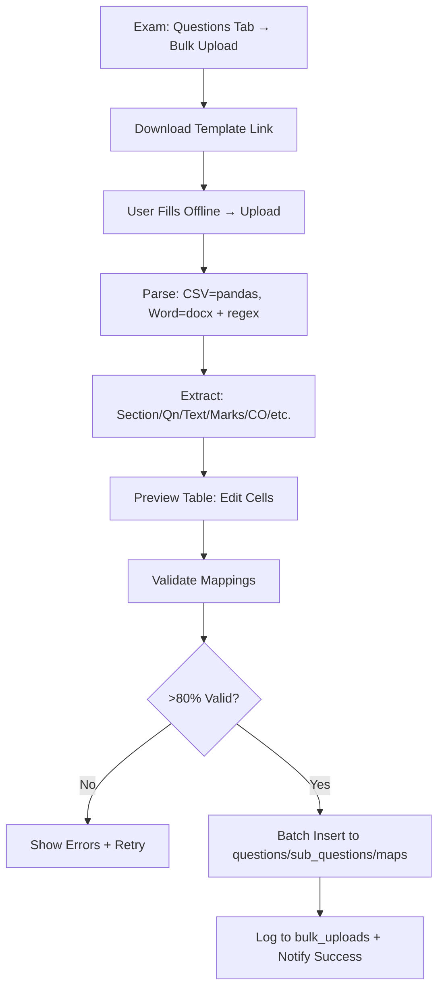

**Dev Notes**:  
- Regex for Word: `r'Section (\w)\nQ(\d+)\. (.*?) \((\d+) marks\)'`.  
- Pandas for CSV: `df.to_sql`.  
- Edge: Malformed file → return row-specific errors JSON.  

### **FR-10: Generate Question Paper PDF (Auto)**  
**Purpose**: Printable output for offline use. **T, H, P**.  

**Inputs**: Exam ID + options (include answers? No).  

**Outputs**: Downloadable PDF.  

**Validation**: All sections filled.  

**Flow Diagram**:  
```mermaid
graph TD
    A[Exam Detail → Generate Paper] --> B[Query Questions + Order]
    B --> C[Build HTML: Header/Instructions/Sections/Qns]
    C --> D[Add Logo + Footer (Date/Roll Space)]
    D --> E[WeasyPrint: HTML → PDF]
    E --> F[Store Path in exams.question_paper_pdf_path]
    F --> G[Download Link + Print Preview]
```

**Dev Notes**:  
- HTML template: Jinja2.  
- UI: Embed PDF viewer (react-pdf).  
- Edge: Custom paper size (A4).  

### **FR-11: Start Marks Entry for Exam (Manual)**  
**Purpose**: Granular scoring post-offline exam. **T**.  

**Inputs**: Per cell: `{ student_id, qn_id/sub_id, marks_obtained }`  

**Outputs**: Updated grid; running totals.  

**Validation**: Marks ≥0 ≤ max; auto-save.  

**Flow Diagram**:  
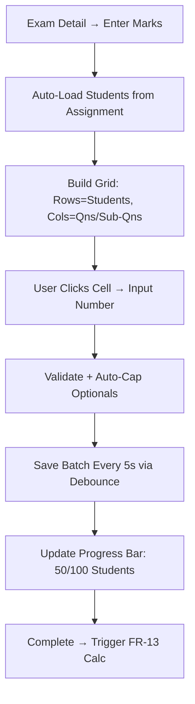

**Dev Notes**:  
- Grid: AG-Grid (editable, cell renderer for max).  
- Debounce: Lodash 5s.  
- Edge: Partial entry → save as 'incomplete'.  

### **FR-12: Bulk Marks Upload**  
**Purpose**: High-volume entry. **T**.  

**Inputs**: Excel/CSV with pre-filled students.  

**Outputs**: Summary: "95/100 uploaded, 5 errors".  

**Validation**: Match student IDs; marks numeric.  

**Flow Diagram**:  
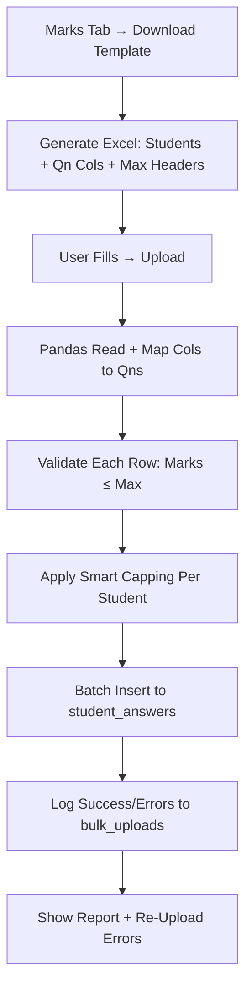

**Dev Notes**:  
- openpyxl for Excel gen.  
- Map: Col 'Q1' → qn_id 1.  
- Edge: Duplicate rows → skip/log.  

### **FR-13: Smart Mark Calculation (Per Exam)**  
**Purpose**: Ensure fair, rule-based totals. **System (on save/publish)**.  

**Logic Example**: Section A: Required 4, Optional 2, 5 marks/qn. Student scores [8,7,9,6,5,4] → Sort desc [9,8,7,6,5,4] → Top 4: 9+8+7+6=30 → Cap 20. Sub: Sum children ≤ parent.  

**Inputs**: Raw `student_answers`.  
**Outputs**: Aggregated in `final_marks`.  

**Validation**: Totals match exam total_marks.  

**Flow Diagram**:  
```mermaid
graph TD
    A[Marks Saved (Manual/Bulk)] --> B[Trigger Calc Job (Celery)]
    B --> C[For Each Student/Section]
    C --> D[Query Answers for Section]
    D --> E{Answered > Required?}
    E -->|Yes| F[Sort Desc + Sum Top Required]
    E -->|No| G[Sum All Answered]
    F --> H[Cap at Required * Marks/Qn]
    G --> H
    H --> I[Sub-Q: Sum Children → Cap Parent]
    I --> J[Total Section → Aggregate Exam Total]
    J --> K[Store best_internal, total in final_marks]
```

**Dev Notes**:  
- Python func: `def calculate_smart_marks(answers): ...` with NumPy sort.  
- Run async; notify on error.  
- Edge: Zero answers → 0, flag 'absent'.  

### **FR-14: 7-Day Edit Window**  
**Purpose**: Balance flexibility/security. **T (window), P/H (override)**.  

**Inputs**: Edit request + reason (for override).  

**Outputs**: Updated marks + audit entry.  

**Validation**: Check `editable_until > now` for T.  

**Flow Diagram**:  
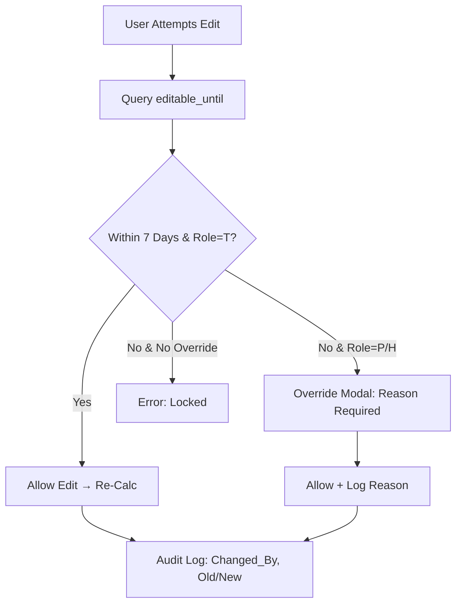

**Dev Notes**:  
- Set `editable_until = exam_date + 7 days`.  
- API Guard: `@requires_role('teacher') and check_date()`.  
- Edge: Bulk re-upload in window → full recalc.  

### **FR-15: Auto Final Internal = Best of I1, I2**  
**Purpose**: Dept-configurable aggregation. **System (on publish)**.  

**Options**: Best/Avg/Weighted (from `dept_settings`).  

**Flow Diagram**:  
```mermaid
graph TD
    A[Both I1/I2 Published] --> B[Query Dept Setting]
    B --> C{Method?}
    C -->|Best| D[Max(I1 Total, I2 Total)]
    C -->|Avg| E[(I1 + I2)/2]
    C -->|Weighted| F[I1*0.4 + I2*0.6]
    D --> G[Store best_internal]
    E --> G
    F --> G
    G --> H[Recalc Total = Best*0.4 + Ext*0.6]
```

**Dev Notes**:  
- Table: `dept_settings (method ENUM)`.  
- Trigger: On I2 publish.  
- Edge: Missing I1 → use I2.  

### **FR-16: Auto Total, Grade, SGPA/CGPA**  
**Purpose**: End-to-end scoring. **System**.  

**Formula**: Total = Internal*0.4 + External*0.6; Grade from rules; SGPA = weighted avg.  

**Flow Diagram**:  
```mermaid
graph TD
    A[All Exams per Sem Complete] --> B[Calc Totals per Subject]
    B --> C[Lookup Grade: if total>=90 → A+]
    C --> D[SGPA: Sum(Grade_Point * Credits) / Total Credits]
    D --> E[CGPA: Rolling Avg Across Sems]
    E --> F[Store in final_marks]
    F --> G[Flag Fail if <40 in Any Subject]
```

**Dev Notes**:  
- `grading_rules` table per dept.  
- CGPA: Query prev sems.  
- Edge: Backlogs → separate CGPA calc.  

### **FR-17: Publish Results**  
**Purpose**: Official release. **H, P**.  

**Inputs**: Semester ID + confirm.  

**Outputs**: Status update; notifications/PDFs.  

**Flow Diagram**:  
```mermaid
graph TD
    A[HOD/P: Sem Overview → Publish] --> B[Check All Exams Complete?]
    B --> C{Yes?}
    C -->|No| D[Error: Missing I2 for Subject X]
    C -->|Yes| E[Set Status Published + Calc CO-PO]
    E --> F[Generate PDFs per Student (Celery)]
    F --> G[Email/SMS Notify Students]
    G --> H[Update Dashboards]
```

**Dev Notes**:  
- Transactional: All or nothing.  
- Notification: Via SMTP/WebSocket.  
- Edge: Partial publish → warn.  

### **FR-18: Student Views Detailed Marks + CO-PO**  
**Purpose**: Transparent self-access. **S**.  

**Outputs**: Interactive report with charts.  

**Flow Diagram**:  
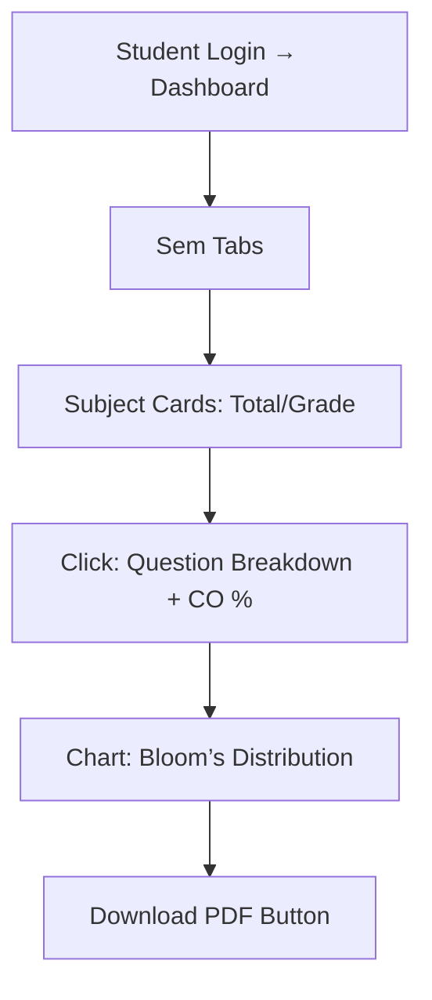

**Dev Notes**:  
- Query: Own student_id only.  
- UI: Responsive cards.  
- Edge: Unpublished sem → "Pending".  

### **FR-19: CO-PO Attainment Dashboard**  
**Purpose**: OBE insight hub. **P, H, T** (scoped).  

**Calculations**: CO% = (Sum marks in CO qns / Max CO marks) * 100; PO% = Avg linked COs.  

**Flow Diagram**:  
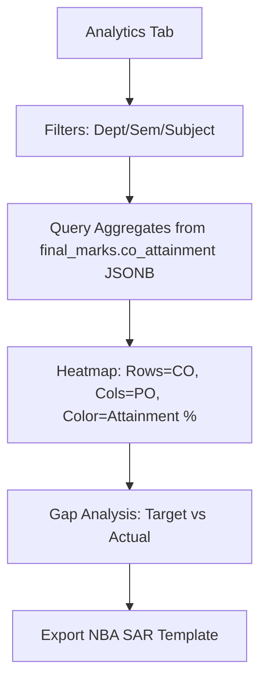

**Dev Notes**:  
- Pre-compute JSONB nightly.  
- Recharts heatmap.  
- Edge: Low attainment → alert HOD.  

### **FR-20: Bloom’s Level Analysis**  
**Purpose**: Pedagogy quality check. **P, H, T**.  

**Outputs**: % pie chart (L1 20%, L2 30%, etc.).  

**Flow Diagram**:  
```mermaid
graph TD
    A[Analytics → Bloom’s Filter] --> B[Group Questions by Level]
    B --> C[Count % per Subject/Sem]
    C --> D[Donut Chart + Table]
    D --> E[Trend Line: Sem1 vs Sem2]
```

**Dev Notes**:  
- Query: `GROUP BY bloom_level`.  
- Target: Balanced L1–L6.  
- Edge: No L6 → recommend.  

### **FR-21: Multi-Dimensional Analytics**  
**Purpose**: Drill-down insights. **P, H**.  

**Dimensions**: Year/Branch/Teacher/Student.  

**Flow Diagram**:  
```mermaid
graph TD
    A[Global Analytics] --> B[Dimension Selector: Year/Branch/etc.]
    B --> C[SQL Pivot: e.g., Pass% by Branch-Year]
    C --> D[Bar/Line Charts]
    D --> E[Drill: Click Branch → Teacher View]
    E --> F[Export CSV]
```

**Dev Notes**:  
- Pandas for pivots (backend).  
- Cache queries (Redis).  
- Edge: Empty data → "No Records".  

### **FR-22: Export Reports**  
**Purpose**: Official outputs. **P, H, T, S**.  

**Formats**: PDF (WeasyPrint), Excel (Pandas), JSON.  

**Flow Diagram**:  
```mermaid
graph TD
    A[Report Button] --> B[Type: Class/Subject/CO-PO]
    B --> C[Query Data + Template]
    C --> D{PDF?}
    D -->|Yes| E[HTML → WeasyPrint]
    D -->|No| F[DataFrame → Excel/JSON]
    E --> G[Download]
    F --> G
```

**Dev Notes**:  
- Templates: NBA-specific layouts.  
- UI: Progress bar for large exports.  
- Edge: Watermark sensitive PDFs.  

### **FR-23: Audit Trail**  
**Purpose**: Compliance logging. **P, H** (view).  

**Outputs**: Searchable log table.  

**Flow Diagram**:  
```mermaid
graph TD
    A[Any Change: Marks/Edit] --> B[DB Trigger: Insert to mark_audit_log]
    B --> C[Fields: Who, What, Old/New, Reason, TS]
    C --> D[H/P View: Filter by User/Date]
    D --> E[Export Log CSV]
```

**Dev Notes**:  
- PostgreSQL trigger: `AFTER UPDATE ON student_answers`.  
- UI: Timelime view.  
- Edge: Bulk → one log per batch.  

---

## **5. ENHANCEMENTS & ADDITIONS**  
To strengthen for colleges:  

| Enhancement | Details | Flow Snippet |
|-------------|---------|--------------|
| **Re-evaluation Requests** | Students request mark review (fee-based). | Student → Submit Req → HOD Review → Update/Audit. |
| **Backlog Management** | Track failed subjects across sems. | Publish → Flag Fails → Separate CGPA Calc. |
| **Resource Recommendations** | AI suggest based on weak CO (future). | Analytics → Low CO → Link to videos/notes. |
| **Integration Hooks** | API for ERP (attendance sync). | Webhook on publish → send SGPA to ERP. |

**Full Re-evaluation Flow** (Mermaid):  
```mermaid
graph TD
    A[Student: View Marks → Request Re-eval] --> B[Pay Fee + Select Subject]
    B --> C[Notify Teacher/HOD]
    C --> D[Review Answers → Approve/Reject]
    D -->|Approve| E[Recalc + Refund Fee]
    E --> F[Audit + Notify Student]
```

---

## **6. FULL DATABASE SCHEMA (SQL with Indexes)**  

```sql
-- Users & Roles
CREATE TABLE users (
  id SERIAL PRIMARY KEY,
  name VARCHAR(100) NOT NULL,
  email VARCHAR(100) UNIQUE NOT NULL,
  password_hash VARCHAR(255) NOT NULL,
  is_active BOOLEAN DEFAULT TRUE,
  created_at TIMESTAMP DEFAULT NOW()
);
CREATE INDEX idx_users_email ON users(email);

CREATE TABLE user_roles (
  user_id INT REFERENCES users(id) ON DELETE CASCADE,
  role ENUM('principal', 'hod', 'teacher', 'student') NOT NULL,
  dept_id INT NULL,  -- For H/T/S
  PRIMARY KEY (user_id, role)
);

-- Academic Hierarchy
CREATE TABLE departments (
  id SERIAL PRIMARY KEY,
  name VARCHAR(100) NOT NULL,
  code VARCHAR(10) UNIQUE NOT NULL,
  hod_id INT REFERENCES users(id),
  created_at TIMESTAMP DEFAULT NOW()
);

CREATE TABLE batches (
  id SERIAL PRIMARY KEY,
  name VARCHAR(50) NOT NULL,  -- B.Tech
  duration_years INT NOT NULL CHECK (duration_years BETWEEN 2 AND 5)
);

CREATE TABLE batch_years (
  id SERIAL PRIMARY KEY,
  batch_id INT REFERENCES batches(id),
  start_year INT NOT NULL,
  end_year INT NOT NULL CHECK (end_year > start_year),
  is_current BOOLEAN DEFAULT FALSE
);
CREATE INDEX idx_batch_years_current ON batch_years(is_current);

CREATE TABLE semesters (
  id SERIAL PRIMARY KEY,
  batch_year_id INT REFERENCES batch_years(id),
  semester_no INT NOT NULL CHECK (semester_no BETWEEN 1 AND 8),
  is_current BOOLEAN DEFAULT FALSE,
  start_date DATE,
  end_date DATE CHECK (end_date > start_date),
  UNIQUE (batch_year_id, semester_no)
);

-- Students & Teachers
CREATE TABLE students (
  id SERIAL PRIMARY KEY,
  user_id INT REFERENCES users(id),
  roll_no VARCHAR(20) UNIQUE NOT NULL,
  dept_id INT REFERENCES departments(id),
  batch_year_id INT REFERENCES batch_years(id),
  current_semester_id INT REFERENCES semesters(id)
);

CREATE TABLE teachers (
  id SERIAL PRIMARY KEY,
  user_id INT REFERENCES users(id),
  dept_id INT REFERENCES departments(id)
);

-- Subjects & Assignments
CREATE TABLE subjects (
  id SERIAL PRIMARY KEY,
  dept_id INT REFERENCES departments(id),
  name VARCHAR(100) NOT NULL,
  code VARCHAR(20) UNIQUE NOT NULL,
  credits DECIMAL(3,1) NOT NULL,
  max_internal DECIMAL(5,2) DEFAULT 40,
  max_external DECIMAL(5,2) DEFAULT 60
);

CREATE TABLE subject_assignments (
  id SERIAL PRIMARY KEY,
  subject_id INT REFERENCES subjects(id),
  teacher_id INT REFERENCES teachers(id),
  batch_year_id INT REFERENCES batch_years(id),
  semester_id INT REFERENCES semesters(id),
  UNIQUE (subject_id, teacher_id, batch_year_id, semester_id)
);

-- OBE: PO/CO
CREATE TABLE program_outcomes (
  id SERIAL PRIMARY KEY,
  dept_id INT REFERENCES departments(id),
  code VARCHAR(10) NOT NULL,  -- PO1
  description TEXT NOT NULL,
  target_attainment DECIMAL(5,2) DEFAULT 70,  -- %
  UNIQUE (dept_id, code)
);

CREATE TABLE course_outcomes (
  id SERIAL PRIMARY KEY,
  subject_id INT REFERENCES subjects(id),
  code VARCHAR(10) NOT NULL,  -- CO1
  description TEXT NOT NULL,
  po_mappings JSONB DEFAULT '[]',  -- ["PO1", "PO3"]
  UNIQUE (subject_id, code)
);

-- Question Bank (Per Exam)
CREATE TABLE questions (
  id SERIAL PRIMARY KEY,
  exam_id INT REFERENCES exams(id) ON DELETE CASCADE,
  subject_id INT REFERENCES subjects(id),
  teacher_id INT REFERENCES teachers(id),
  section CHAR(1) NOT NULL CHECK (section IN ('A','B','C')),
  qn_text TEXT NOT NULL,
  marks_per_qn DECIMAL(5,2) NOT NULL,
  required_count INT DEFAULT 1,
  optional_count INT DEFAULT 0 CHECK (optional_count >= 0),
  bloom_level VARCHAR(10) CHECK (bloom_level ~ '^L[1-6]$'),  -- L1-L6
  qn_no INT NOT NULL
);
CREATE INDEX idx_questions_exam ON questions(exam_id);

CREATE TABLE question_co_map (
  question_id INT REFERENCES questions(id) ON DELETE CASCADE,
  co_id INT REFERENCES course_outcomes(id),
  PRIMARY KEY (question_id, co_id)
);

CREATE TABLE question_po_map (
  question_id INT REFERENCES questions(id) ON DELETE CASCADE,
  po_id INT REFERENCES program_outcomes(id),
  PRIMARY KEY (question_id, po_id)
);

CREATE TABLE sub_questions (
  id SERIAL PRIMARY KEY,
  question_id INT REFERENCES questions(id) ON DELETE CASCADE,
  sub_text TEXT,
  marks DECIMAL(5,2) NOT NULL,
  sub_no VARCHAR(10)  -- 1a, 1b
);

-- Exams (Central)
CREATE TABLE exams (
  id SERIAL PRIMARY KEY,
  subject_assignment_id INT REFERENCES subject_assignments(id),
  exam_type ENUM('I1', 'I2', 'External') NOT NULL,
  exam_name VARCHAR(100) NOT NULL,
  exam_date DATE NOT NULL,
  total_marks DECIMAL(5,2) NOT NULL,
  duration_min INT,
  instructions TEXT,
  question_paper_pdf_path VARCHAR(255),
  status ENUM('draft', 'questions_added', 'marks_entry', 'locked', 'published') DEFAULT 'draft',
  created_by INT REFERENCES users(id),
  created_at TIMESTAMP DEFAULT NOW(),
  UNIQUE (subject_assignment_id, exam_type)
);
CREATE INDEX idx_exams_status ON exams(status);
CREATE INDEX idx_exams_date ON exams(exam_date);

-- Marks Entry
CREATE TABLE student_answers (
  id SERIAL PRIMARY KEY,
  student_id INT REFERENCES students(id),
  exam_id INT REFERENCES exams(id),
  question_id INT REFERENCES questions(id),
  sub_question_id INT REFERENCES sub_questions(id) NULL,
  marks_obtained DECIMAL(5,2) DEFAULT 0 CHECK (marks_obtained >= 0),
  entered_at TIMESTAMP DEFAULT NOW(),
  updated_at TIMESTAMP DEFAULT NOW()
);
CREATE INDEX idx_answers_student_exam ON student_answers(student_id, exam_id);

-- Aggregated Final Marks
CREATE TABLE final_marks (
  id SERIAL PRIMARY KEY,
  student_id INT REFERENCES students(id),
  subject_assignment_id INT REFERENCES subject_assignments(id),
  internal_1 DECIMAL(5,2) DEFAULT 0,
  internal_2 DECIMAL(5,2) DEFAULT 0,
  best_internal DECIMAL(5,2) DEFAULT 0,
  external DECIMAL(5,2) DEFAULT 0,
  total DECIMAL(5,2) DEFAULT 0,
  grade CHAR(2) DEFAULT 'F',  -- A+, A, B, etc.
  sgpa DECIMAL(3,2),
  cgpa DECIMAL(3,2),
  co_attainment JSONB DEFAULT '{}',  -- {"CO1": 75, "CO2": 82}
  status ENUM('draft', 'locked', 'published') DEFAULT 'draft',
  editable_until DATE
);
CREATE INDEX idx_final_marks_student ON final_marks(student_id);

-- Audit & Logs
CREATE TABLE mark_audit_log (
  id SERIAL PRIMARY KEY,
  answer_id INT REFERENCES student_answers(id),
  changed_by INT REFERENCES users(id),
  field VARCHAR(50) NOT NULL,  -- 'marks_obtained'
  old_value DECIMAL(5,2),
  new_value DECIMAL(5,2),
  reason TEXT,
  timestamp TIMESTAMP DEFAULT NOW()
);

CREATE TABLE bulk_uploads (
  id SERIAL PRIMARY KEY,
  upload_type ENUM('questions', 'marks') NOT NULL,
  exam_id INT REFERENCES exams(id) NULL,
  file_name VARCHAR(255) NOT NULL,
  uploaded_by INT REFERENCES users(id),
  uploaded_at TIMESTAMP DEFAULT NOW(),
  total_rows INT,
  success_count INT,
  error_count INT,
  error_log JSONB  -- Array of {"row":1, "error":"Invalid marks"}
);

-- Settings
CREATE TABLE dept_settings (
  dept_id INT PRIMARY KEY REFERENCES departments(id),
  internal_method ENUM('best', 'avg', 'weighted') DEFAULT 'best',
  grading_scale JSONB DEFAULT '{"A+":90, "A":80, ...}'  -- Min %
);
```

**Dev Notes on Schema**:  
- **Indexes**: For common queries (e.g., student marks).  
- **Constraints**: Prevent invalid data (e.g., negative marks).  
- **JSONB**: Flexible for mappings/attainment.  
- **Migrations**: Use Alembic for changes.  
- **Sample Data**: Seed with dummy batches/depts for testing.  

---

## **7. TECHNOLOGY STACK – EXPANDED**  

| Layer | Technology | Why? | Setup Notes |
|-------|------------|------|-------------|
| **Frontend** | React.js 18 + TailwindCSS + Vite | Fast, responsive UIs; mobile-first. | `npm create vite@latest`; AG-Grid Pro for grids. |
| **Backend** | FastAPI + SQLAlchemy + Pydantic | Async APIs, auto-docs (Swagger). | `pip install fastapi sqlalchemy pydantic`; Uvicorn server. |
| **Database** | PostgreSQL 15 | ACID, JSONB support. | Docker: `postgres:15`; pgAdmin for viz. |
| **Auth** | JWT (PyJWT) + bcrypt | Secure, stateless. | Refresh in Redis for blacklist. |
| **PDF/Excel** | WeasyPrint / openpyxl + Pandas | Rich PDFs; bulk data. | `pip install weasyprint openpyxl pandas`. |
| **Analytics** | NumPy / Pandas + Recharts | Fast calcs; interactive viz. | Backend jobs with Celery + Redis. |
| **Deployment** | Docker Compose + Nginx | Containerized, scalable. | See YAML below. |
| **Testing** | Pytest (backend), Jest (frontend) | 80% coverage. | CI: GitHub Actions. |
| **Monitoring** | Sentry + Prometheus | Error tracking; perf. | Optional v1. |

**Docker Compose (Full)**:  
```yaml
version: '3.8'
services:
  db:
    image: postgres:15
    environment:
      POSTGRES_DB: smartlms
      POSTGRES_USER: admin
      POSTGRES_PASSWORD: secret
    volumes:
      - postgres_data:/var/lib/postgresql/data
    ports:
      - "5432:5432"

  redis:
    image: redis:7
    ports:
      - "6379:6379"

  backend:
    build: ./backend
    command: uvicorn main:app --host 0.0.0.0 --port 8000 --reload
    volumes:
      - ./backend:/app
    depends_on:
      - db
      - redis
    environment:
      DATABASE_URL: postgresql://admin:secret@db:5432/smartlms
      REDIS_URL: redis://redis:6379

  frontend:
    build: ./frontend
    command: npm run dev
    volumes:
      - ./frontend:/app
      - /app/node_modules
    ports:
      - "3000:3000"
    depends_on:
      - backend

  celery:
    build: ./backend
    command: celery -A tasks worker --loglevel=info
    depends_on:
      - backend
      - redis

  nginx:
    image: nginx:alpine
    ports:
      - "80:80"
    volumes:
      - ./nginx.conf:/etc/nginx/nginx.conf
    depends_on:
      - frontend
      - backend

volumes:
  postgres_data:
```

---

## **8. API ENDPOINTS – FULL SPEC (Swagger-Ready)**  

**Base**: `/api/v1`  
**Auth**: Bearer JWT on all except login.  

| Method | Endpoint | Roles | Description | Request Body/Example | Response |
|--------|----------|-------|-------------|----------------------|----------|
| POST | `/auth/login` | All | Login | `{ "email": "user@college.edu", "password": "pass123" }` | `{ "access_token": "...", "refresh_token": "..." }` |
| POST | `/auth/refresh` | All | Refresh token | `{ "refresh_token": "..." }` | New access token |
| POST | `/principal/batches` | P | Create batch | `{ "name": "B.Tech", "duration_years": 4 }` | 201 Created |
| GET | `/principal/batches` | P | List batches | - | Array of batches |
| POST | `/principal/departments` | P | Create dept | `{ "name": "CSE", "code": "CSE", "hod_id": 5 }` | 201 |
| GET | `/hod/outcomes/po` | H | List PO | - | PO array |
| POST | `/hod/outcomes/co` | H | Add CO | `{ "subject_id": 1, "code": "CO1", "description": "...", "po_mappings": ["PO1"] }` | 201 |
| POST | `/exams` | T,H,P | Create exam | `{ "subject_assignment_id": 1, "exam_type": "I1", ... }` | Exam object |
| GET | `/teacher/exams` | T | My exams | - | Paginated list |
| POST | `/exams/{exam_id}/questions` | T,H,P | Manual question | `{ "qn_text": "...", "section": "A", ... }` | Question ID |
| POST | `/exams/{exam_id}/questions/bulk` | T,H,P | Bulk upload | Multipart file | Parse summary |
| GET | `/exams/{exam_id}/template/marks` | T | Download marks template | - | Excel file stream |
| POST | `/exams/{exam_id}/marks/bulk` | T | Upload marks | Multipart file | Upload log |
| PUT | `/exams/{exam_id}/marks/{answer_id}` | T,H,P | Edit mark | `{ "marks_obtained": 8 }` | Updated |
| POST | `/semesters/{sem_id}/publish` | H,P | Publish sem | - | 200 OK |
| GET | `/student/marks/sem/{sem_id}` | S | My marks | - | Marks + CO JSON |
| GET | `/analytics/co-po/{scope}` | P,H,T | Attainment | Query: ?dept=1&sem=3 | Heatmap data |
| GET | `/reports/export/{type}` | P,H,T,S | Export | Query: ?format=pdf&scope=sem3 | File stream |

**Dev Notes**:  
- All: Pydantic models for validation.  
- Pagination: `limit/offset` on lists.  
- Errors: Standard `{ "detail": "Error msg" }` 4xx/5xx.  
- Swagger: Auto at `/docs`.  

---

## **9. NON-FUNCTIONAL REQUIREMENTS – EXPANDED**  

| Category | Requirement | Details | Measurement |
|----------|-------------|---------|-------------|
| **Security** | bcrypt + JWT + HTTPS | Hash all pw; RBAC on every endpoint; OWASP top 10 compliant. | Penetration test pass. |
| **Performance** | <1.5s API response; 500 concurrent. | Async FastAPI; index DB; Redis cache. | Load test with Locust. |
| **Scalability** | Horizontal (Docker Swarm). | Stateless backend; DB sharding future. | Handle 10k students. |
| **Usability** | Intuitive UI; accessibility (WCAG). | Tooltips, keyboard nav; dark mode. | User testing score >85%. |
| **Reliability** | 99.9% uptime; daily backups. | Health checks; pg_dump cron. | MTTR <1hr. |
| **Maintainability** | Modular code; 80% test cov. | Type hints; docs in code. | SonarQube A grade. |
| **Data Integrity** | Transactions; FK constraints. | Rollback on errors. | No orphan records. |

---

## **10. TESTING & DEPLOYMENT – EXPANDED**  

### **Testing Strategy**  
- **Unit**: Pytest for calc logic (e.g., smart capping).  
- **Integration**: Postman for APIs (e.g., bulk upload flow).  
- **E2E**: Cypress for UI (login → publish).  
- **Load**: JMeter for 500 users.  
- **Coverage**: >80%; include edge cases (e.g., 0 marks).  

### **Deployment Flow** (Mermaid):  
```mermaid
graph TD
    A[Git Push] --> B[CI: Lint/Test/Build Docker]
    B --> C{All Pass?}
    C -->|No| D[Slack Alert]
    C -->|Yes| E[CD: Deploy to Staging]
    E --> F[Manual QA Approve]
    F --> G[Deploy to Prod: Blue-Green]
    G --> H[Monitor: Logs/Metrics]
```

**Prod Setup**: AWS/EC2 + RDS; CI/CD GitHub Actions.  

---

## **11. FUTURE SCOPE & LIMITATIONS**  

**Scope**:  
- v2: Online quizzes, AI question gen.  
- v3: Mobile app, parent portal.  

**Limitations**:  
- Offline exams only (no proctoring).  
- Requires stable internet for uploads.  

---

## **12. CONCLUSION & DEV TEAM GUIDELINES**  

This **SmartLMS** is a **transformative tool**—from chaotic mark sheets to **OBE-powered insights**.  

**Guidelines**:  
- **Prioritize**: Exam flow first (FR-07–13).  
- **Code Style**: PEP8; commit atomic.  
- **Questions?**: Use issues; weekly sync.  
- **Goal**: MVP in 8 weeks; full in 16.  

**Ready to Code?** Reply for specifics (e.g., "Implement FR-13 Python"). If too long, let's chunk—next: Code samples?  

---